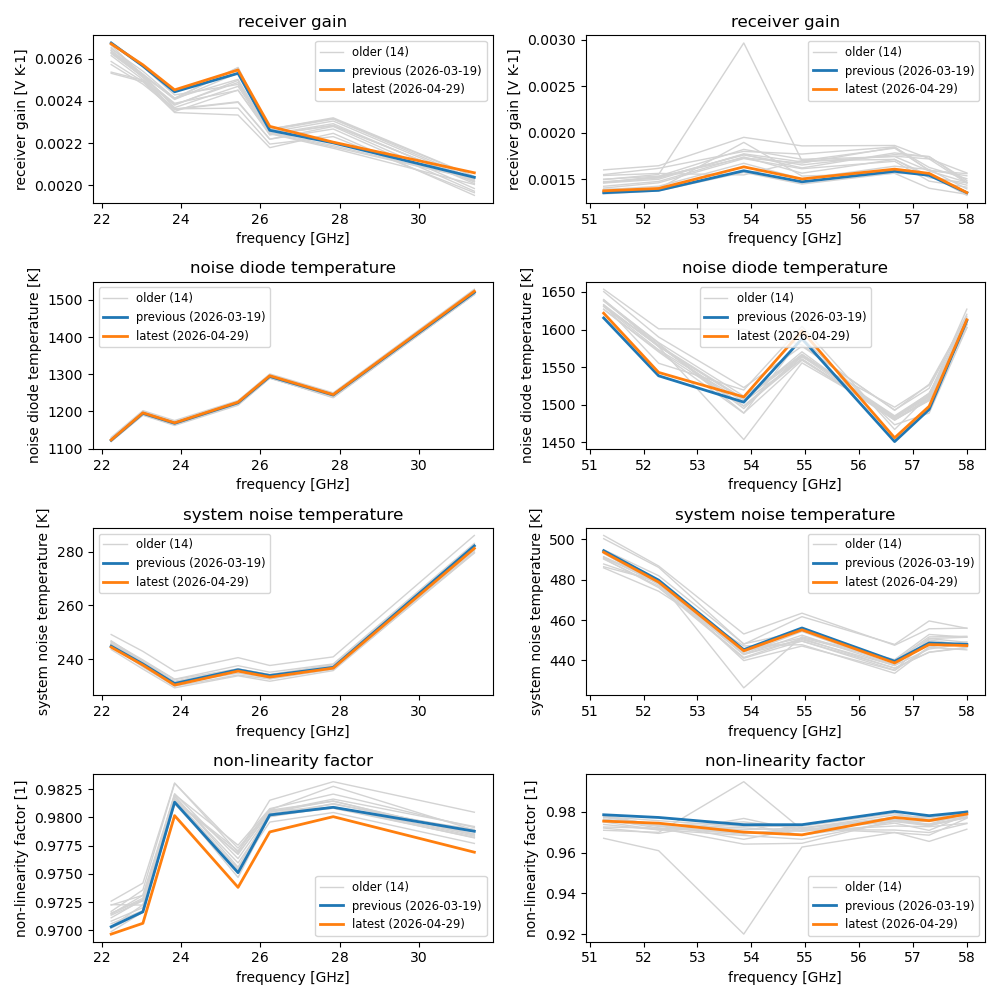
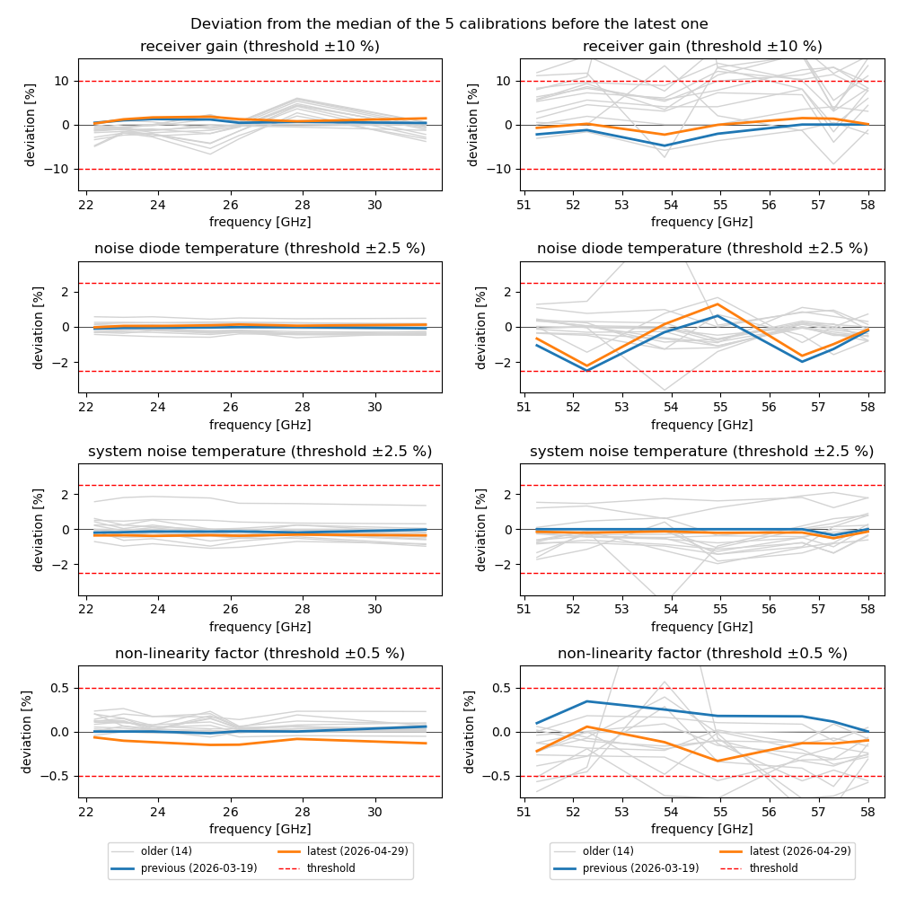

[](https://github.com/WillyWallace/eval_ac/actions/workflows/python-package.yml)
[](https://github.com/WillyWallace/eval_ac/actions/workflows/pylint.yml)
[](https://opensource.org/licenses/MIT)
[](https://github.com/WillyWallace/eval_ac/releases/)
[](https://github.com/Naereen/badges/)
[](https://github.com/WillyWallace/eval_ac/graphs/commit-activity)


<!-- [![Release][release-shield]][release-url] -->
<!-- [](https://pypi.com/project/pip) -->

<!-- [](https://twitter.com/RSAtmos_LIM) -->

# Read the ABSCAL.HIS file and visualize the results of the absolute calibration with liquid nitrogen of an RPG microwave radiometer

<!-- TABLE OF CONTENTS -->
<details>
  <summary>Table of Contents</summary>
  <ol>
    <li><a href="#Introduction">Introduction</a></li>
    <li><a href="#getting-started">Getting Started</a></li>
    <li><a href="#Usage">Usage</a></li>
    <li><a href="#roadmap">Roadmap</a></li>
    <!-- <li><a href="#contributing">Contributing</a></li> -->
    <li><a href="#license">License</a></li>
    <li><a href="#contact">Contact</a></li>
    <li><a href="#acknowledgments">Acknowledgments</a></li>
  </ol>
</details>

<!-- Introduction -->
## Introduction

This repository was created to display the results of the absolute calibration with liquid nitrogen of the microwave radiometer HATPRO manufactured by Radiometer Physics GmbH. For this purpose, the binary file ABSCAL.HIS is read in and converted into an xarray. Then the receiver gain, the temperature of the noise diode, the temperature of the system noise and the non-linearity factor are displayed in comparison to the previous and other prior calibrations.

<!-- GETTING STARTED -->
## Getting Started

### Installation

eval_ac requires Python 3.9 or newer. The dependencies (numpy, xarray, matplotlib, netCDF4) are installed automatically.

1. Clone the repo
   ```sh
   git clone https://github.com/WillyWallace/eval_ac.git
   cd eval_ac
   ```

2. Install the package
   ```sh
   pip install .
   ```
   For development (editable install with test and lint tools):
   ```sh
   pip install -e ".[dev]"
   ```

<p align="right">(<a href="#top">back to top</a>)</p>

<!-- USAGE EXAMPLES -->
## Usage

### Command line

```sh
eval-ac path/to/ABSCAL.HIS --netcdf abscal.nc
```

This writes the NetCDF file, the history plot `results_ln2_cal.png`, the drift plot `results_ln2_drift.png` and prints a short quality report of the latest calibration:

```text
read 16 calibration entries from path/to/ABSCAL.HIS
16 of them are calibrations with liquid nitrogen
drift: all channels of the latest calibration are within the thresholds
```

| Option | Description |
| --- | --- |
| `input` | path of the ABSCAL.HIS file (required) |
| `-n`, `--netcdf FILE` | write the converted data (all calibration types) to a NetCDF file |
| `-p`, `--plot FILE` | file name of the history plot (default: `results_ln2_cal.png`) |
| `-d`, `--drift-plot FILE` | file name of the drift plot (default: `results_ln2_drift.png`) |
| `--no-plot` | do not create any plot |
| `--show` | additionally show the plots in a window |
| `--all-cal-types` | use all calibrations instead of only those with liquid nitrogen |
| `--n-reference N` | number of calibrations before the latest one forming the drift reference (default: 5) |
| `-t`, `--threshold VAR=PERCENT` | drift threshold, e.g. `-t gain=8 -t temp_sys=2`; variables: `gain`, `temp_noise`, `temp_sys`, `alpha` |
| `--fail-on-drift` | exit with code 2 if the latest calibration exceeds a threshold (e.g. for cron jobs) |
| `--version` | print the version |

`python -m eval_ac ...` works as well. Try it with the example file:

```sh
eval-ac example_data/ABSCAL.HIS
```

#### History plot

The plot shows the receiver gain, the noise diode temperature, the system noise temperature and the non-linearity factor of both receivers. The latest and the previous calibration of each receiver are highlighted with their dates, all older calibrations are drawn in grey. Channels that were not calibrated (`calibration_flag` = 0) are marked with a red cross. By default, only calibrations with liquid nitrogen are used (`cal_type` = 1); if only one receiver of an entry was calibrated with liquid nitrogen, only this receiver is used.



#### Drift plot

For each receiver, the latest calibration is compared with the median of the 5 calibrations before it (deviation in percent). Channels that were not calibrated are excluded. The dashed red lines are the thresholds, channels of the latest calibration exceeding them are circled and listed in the report. The grey lines show how far the older calibrations deviate from the same reference.

The y-axis is scaled to the thresholds and to the latest and previous calibration. Large outliers of older calibrations are therefore cut off at the edge of the panel; they are still visible in the history plot.



### Interpreting the results

The report and the drift plot point to calibrations that deserve a closer look; they do not decide whether a calibration is good or bad. That decision needs the knowledge of the instrument and of the calibration conditions.

**Why the median of the previous calibrations?** A single failed calibration in the reference would shift a mean, but hardly the median. The previous calibration is part of the reference, so its deviation is usually small.

**Typical patterns**

| Pattern in the drift plot | Possible meaning |
| --- | --- |
| Latest within the thresholds, similar to the grey lines | Calibration consistent with the history. |
| Single channels of the latest calibration out of the thresholds, previous calibration normal | Possibly a problem during this calibration (e.g. of the cold load); check the calibration conditions and consider repeating it. |
| All channels of a receiver shifted in the same direction | Rather a change of the receiver itself (e.g. after maintenance or a hardware change) than a single failed calibration. |
| Latest and previous calibration deviate in the same way | The change is confirmed by two calibrations and is probably real; the reference (the 5 calibrations before) still describes the old state. |
| Channels marked as "not calibrated" (flag 0) | The calibration of these channels was not completed; they are not evaluated. |

**Differences between the variables.** In the example data the receiver gain varies much more between calibrations than the other variables (standard deviation 1–3 % in the K-band and 5–18 % in the V-band, compared with below 2 % for the noise diode temperature and the system noise temperature). The default threshold for the gain is therefore larger. The non-linearity factor is close to 1 and varies only little, so already small relative deviations are noticeable.

**Adapting the thresholds.** The default thresholds are derived from a single HATPRO (2018–2026, 16 calibrations). Instruments, channels and sites differ, so:

1. run `eval-ac` on the full history of your instrument,
2. look at the spread of the grey lines in the drift plot,
3. set thresholds slightly above the usual spread, e.g. `-t gain=6 -t temp_noise=1.5`.

**Limitations**

- With fewer than 5 earlier calibrations, the reference consists of fewer values (see `n_reference_used` in the result of `calibration_drift()`); with none, no drift can be computed.
- Only calibrations with liquid nitrogen are compared by default. Sky tipping calibrations (`cal_type` = 2) are a different method and are not mixed in.
- `calibration_flag` is interpreted as 0 = not calibrated, 1 = calibrated, as defined in the metadata of this package. If your files use further bits of the flag, check the RPG manual of your instrument.

### Python

```python
from eval_ac.convert_abscal_his import read_abscal_his, write_netcdf
from eval_ac.analysis import select_cal_type, calibration_drift, drift_exceedances
from eval_ac.plotting import plot_calibration_history, plot_drift

ds = read_abscal_his("ABSCAL.HIS")   # xarray.Dataset, all calibration types
write_netcdf(ds, "abscal.nc")

ln2 = select_cal_type(ds)            # only calibrations with liquid nitrogen
fig = plot_calibration_history(ln2, variables=["gain", "temp_sys"])
fig.savefig("gain_tsys.png")

drift = calibration_drift(ln2, n_reference=5)
for row in drift_exceedances(drift, thresholds={"gain": 8}):
    print(row)
plot_drift(drift, thresholds={"gain": 8}).savefig("drift.png")
```

The dataset has the dimensions `n_samples` (calibration entries, oldest first) and `freq` (channels). The coordinate `time` holds the date of each calibration, the coordinate `receiver` (1 or 2) assigns each channel to its receiver.

### Running the tests

```sh
pip install -e ".[test]"
pytest
```

<p align="right">(<a href="#top">back to top</a>)</p>

<!-- ROADMAP -->
## Roadmap

- [x] add meaningful docstrings
- [ ] make documentation --> readthedocs
- [x] enable pip install ...
- [ ] publish on PyPI
- [ ] Released version 1
- [x] Add Tests

See the [open issues](https://github.com/WillyWallace/eval_ac/issues) for a full list of proposed features (and known issues) and [CHANGELOG.md](CHANGELOG.md) for the changes of each version.

<p align="right">(<a href="#top">back to top</a>)</p>

<!-- LICENSE -->
## License

Distributed under the MIT License. See `LICENSE` for more information.

<p align="right">(<a href="#top">back to top</a>)</p>

<!-- CONTACT -->
## Contact

[Andreas Foth](https://www.uni-leipzig.de/personenprofil/mitarbeiter/dr-andreas-foth)


<p align="right">(<a href="#top">back to top</a>)</p>

<!-- ACKNOWLEDGMENTS -->
## Acknowledgments

Special thanks for templates and help during implementation.

* [Readme Template](https://github.com/othneildrew/Best-README-Template)
* [cloudnetpy GitHub](https://github.com/actris-cloudnet/cloudnetpy.git)

<p align="right">(<a href="#top">back to top</a>)</p>

