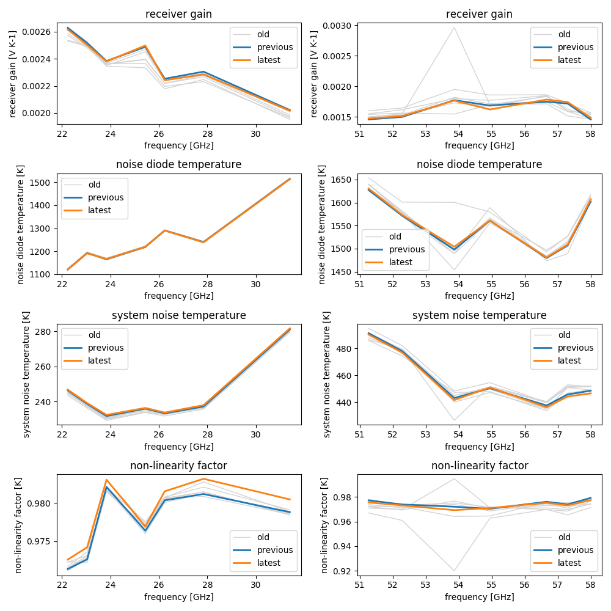

# Read the ABSCAL.HIS file and visualize the results of the absolute calibration with liquid nitrogen of an RPG microwave radiometer

<!-- TABLE OF CONTENTS -->
<details>
  <summary>Table of Contents</summary>
  <ol>
    <li><a href="#Introduction">Introduction</a></li>
    <li><a href="#getting-started">Getting Started</a></li>
    <li><a href="#usage">Usage</a></li>
    <!-- <li><a href="#roadmap">Roadmap</a></li> -->
    <!-- <li><a href="#contributing">Contributing</a></li> -->
    <li><a href="#license">License</a></li>
    <li><a href="#contact">Contact</a></li>
    <li><a href="#acknowledgments">Acknowledgments</a></li>
  </ol>
</details>

<!-- Introduction -->
## Introduction



<!-- GETTING STARTED -->
## Getting Started

<!-- Installation -->
## Installation


_Below is an example of how run the example script, which prepares the data, makes predictions and plots quicklooks. This method relies on external dependencies such as torch, xarray and others (see `setup.py`)._

1. Clone the repo
   ```sh
   git clone https://github.com/WillyWallace/read_and_visualize_abscal-his.git
   ```

2. Install the package
   ```sh
   python setup.py install
   ```

<p align="right">(<a href="#top">back to top</a>)</p>

<!-- USAGE EXAMPLES -->
## Examples

1. Open jupyter notebook
   ```sh
   jupyter notebook
   ```
2. Open one of the example files `Voodoo_predictor_KAZR.ipynb`or `Voodoo_predictor_RPG-FMCW94.ipynb` to review the processing chain.


<p align="right">(<a href="#top">back to top</a>)</p>


<!-- LICENSE -->
## License

Distributed under the MIT License. See `LICENSE` for more information.

<p align="right">(<a href="#top">back to top</a>)</p>

<!-- CONTACT -->
## Contact

Andreas Foth - [@WillyWallace](https://www.uni-leipzig.de/personenprofil/mitarbeiter/dr-andreas-foth)


<p align="right">(<a href="#top">back to top</a>)</p>

<!-- ACKNOWLEDGMENTS -->
## Acknowledgments

Special thanks for templates and help during implementation.

* [Readme Template](https://github.com/othneildrew/Best-README-Template)
* [cloudnetpy GitHub](https://github.com/actris-cloudnet/cloudnetpy.git)

<p align="right">(<a href="#top">back to top</a>)</p>
