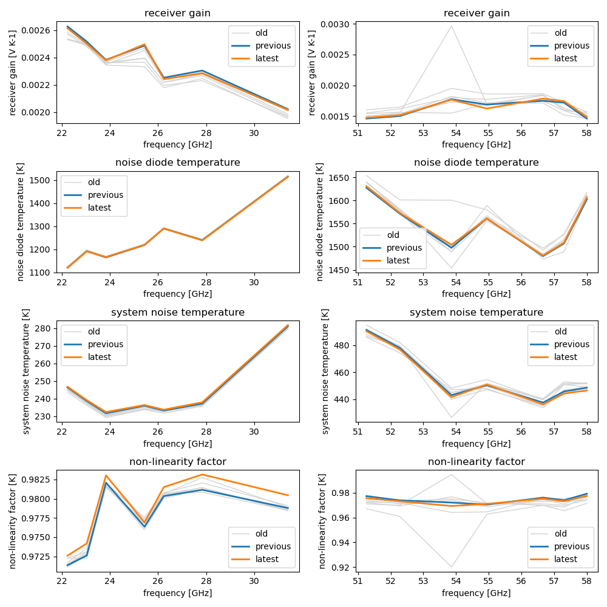

[](https://github.com/WillyWallace/eval_ac/actions/workflows/python-package.yml)
[](https://github.com/WillyWallace/read_and_visualize_abscal-his/actions/workflows/pylint.yml)
[](https://opensource.org/licenses/MIT)
[](https://github.com/WillyWallace/eval_ac/releases/)
[](https://github.com/Naereen/badges/)
[](https://github.com/WillyWallace/eval_ac/graphs/commit-activity)
[](https://twitter.com/RSAtmos_LIM)

<!-- [![Release][release-shield]][release-url] -->
<!-- [](https://pypi.com/project/pip) -->

<!-- [](https://twitter.com/RSAtmos_LIM) -->

# Read the ABSCAL.HIS file and visualize the results of the absolute calibration with liquid nitrogen of an RPG microwave radiometer

<!-- TABLE OF CONTENTS -->
<details>
  <summary>Table of Contents</summary>
  <ol>
    <li><a href="#Introduction">Introduction</a></li>
    <li><a href="#getting-started">Getting Started</a></li>
    <li><a href="#Usage">Usage</a></li>
    <li><a href="#roadmap">Roadmap</a></li>
    <!-- <li><a href="#contributing">Contributing</a></li> -->
    <li><a href="#license">License</a></li>
    <li><a href="#contact">Contact</a></li>
    <li><a href="#acknowledgments">Acknowledgments</a></li>
  </ol>
</details>

<!-- Introduction -->
## Introduction

This repository was created to display the results of the absolute calibration with liquid nitrogen of the microwave radiometer HATPRO manufactured by Radiometer Physics GmbH. For this purpose, the binary file ABSCAL.HIS is read in and converted into an xarray. Then the receiver gain, the temperature of the noise diode, the temperature of the system noise and the non-linearity factor are displayed in comparison to the previous and other prior calibrations.

<!-- GETTING STARTED -->
## Getting Started

<!-- Installation -->
## Installation


Below is an example of how run the script, which reads in the data and plots the results. This method relies on external dependencies such as xarray, numpy and others (see `setup.py`).

1. Clone the repo
   ```sh
   git clone https://github.com/WillyWallace/eval_ac.git
   ```

2. Install the package
   ```sh
   python setup.py install
   ```

<p align="right">(<a href="#top">back to top</a>)</p>

<!-- USAGE EXAMPLES -->
## Usage

1. Open jupyter notebook
   ```sh
   jupyter notebook
   ```
2. Open the 'evaluate_absolute_calibration.ipynb' notebook, see the processing and the results.



<p align="right">(<a href="#top">back to top</a>)</p>

<!-- ROADMAP -->
## Roadmap

- [ ] add meaningful docstrings
- [ ] make documentation --> readthedocs
- [ ] enable pip install ...
- [ ] Released version 1
- [ ] Add Tests

See the [open issues](https://github.com/WillyWallace/eval_ac/issues) for a full list of proposed features (and known issues).

<p align="right">(<a href="#top">back to top</a>)</p>

<!-- LICENSE -->
## License

Distributed under the MIT License. See `LICENSE` for more information.

<p align="right">(<a href="#top">back to top</a>)</p>

<!-- CONTACT -->
## Contact

[Andreas Foth](https://www.uni-leipzig.de/personenprofil/mitarbeiter/dr-andreas-foth)


<p align="right">(<a href="#top">back to top</a>)</p>

<!-- ACKNOWLEDGMENTS -->
## Acknowledgments

Special thanks for templates and help during implementation.

* [Readme Template](https://github.com/othneildrew/Best-README-Template)
* [cloudnetpy GitHub](https://github.com/actris-cloudnet/cloudnetpy.git)

<p align="right">(<a href="#top">back to top</a>)</p>
